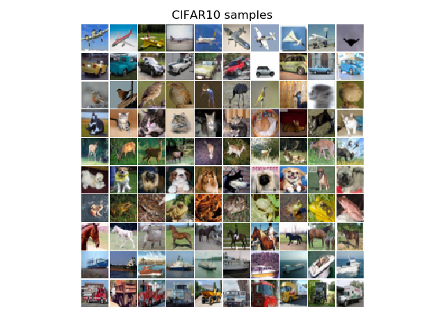
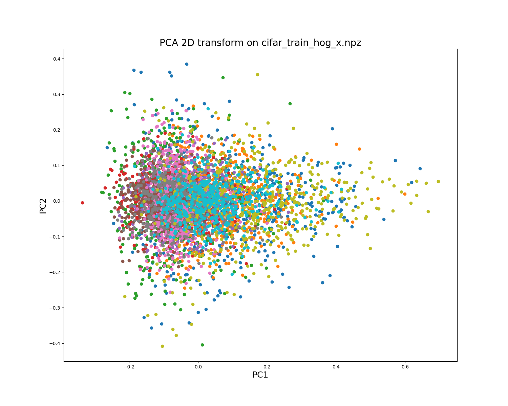
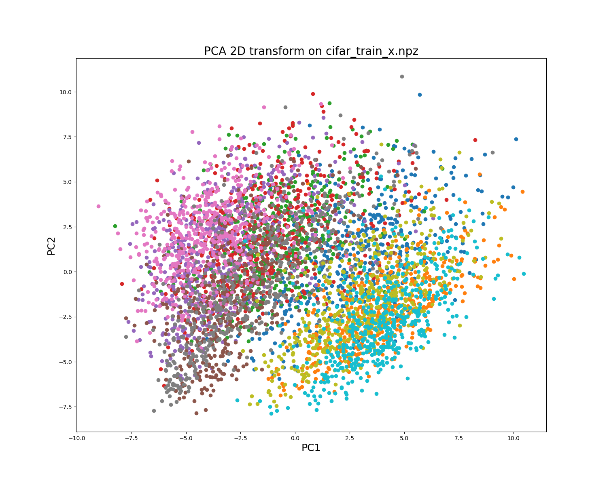
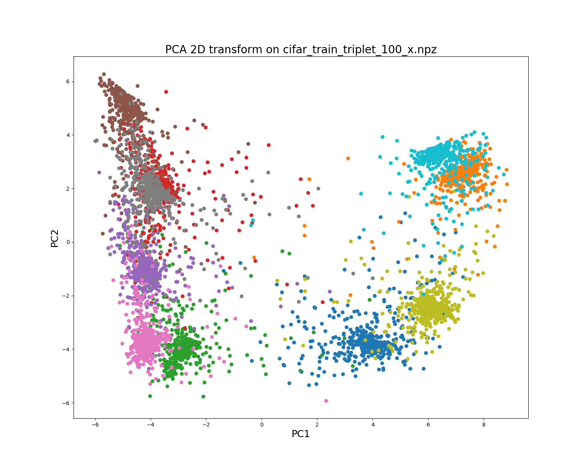

# Classification of CIFAR10 using pretrained feature extractor and SVM model

The project shows, how we can use exemplary pretrained model in Lasagne [Inceptionv3] (https://github.com/Lasagne/Recipes/blob/master/modelzoo/inception_v3.py]) as a feature extractor. The model should be downloaded from [here] (https://s3.amazonaws.com/lasagne/recipes/pretrained/imagenet/inception_v3.pkl) and included in project. The extracted features are further used to train SVM model with linear kernel. 

##  Data preparation

We make use of tools provided in [Improved GAN] (https://github.com/openai/improved-gan]) project. The data can be downloaded from the source or from a given path. The data gathering process can be tested using `test_data.py` script.

The random plots of the images can be obtained using `plot_cifar10.py`:
 
 
 
## Benchmark feature extractor

To provide the empirical evidence, that pretrained deep model generates better features than old-fashioned solutions we extract the features using HOG filters. The process of extracting features using HOG filters is performed by the script `extract_HOG.py`. The extracted features are stored in `cifar_train_hog_x.npz` and `cifar_test_hog_x.npz` for training and testing datasets respectively. 

In the next step we visualise the quality of the features using PCA transform on 2D space:

 
 
In the next step we are going to train the linear SVM classifier on the extract features. We make use of [LIBSVM](https://www.csie.ntu.edu.tw/~cjlin/libsvm/) library in our experiments. The location of the library should be specified in `settings.py`. The process of model selection and final model building is performed by `validate_and_train_SVM.py`. The model selection procedure is perfomed by setting `'-C'` option. The procedure evaluates the possible values by increasing `log(2C)` and selects the best option according to CV rate.

The results for HOG + linear SVM are presented below:

log2c= -18.00   rate=26.992 
log2c= -18.00	rate=26.992
log2c= -17.00	rate=27.578
log2c= -16.00	rate=28.652
log2c= -15.00	rate=30.132
log2c= -14.00	rate=32.538
log2c= -13.00	rate=34.934
log2c= -12.00	rate=36.582
log2c= -11.00	rate=38.492
log2c= -10.00	rate=40.458
log2c=  -9.00	rate=42.496
log2c=  -8.00	rate=44.504
log2c=  -7.00	rate=46.102
log2c=  -6.00	rate=47.326
log2c=  -5.00	rate=48.272
log2c=  -4.00	rate=49.01
log2c=  -3.00	rate=49.528
log2c=  -2.00	rate=50.056
log2c=  -1.00	rate=50.392
log2c=   0.00	rate=50.692
log2c=   1.00	rate=50.978
log2c=   2.00	rate=51.014
log2c=   3.00	rate=51.19
log2c=   4.00	rate=51.238
log2c=   5.00	rate=51.248
log2c=   6.00	rate=51.256
log2c=   7.00	rate=51.256
log2c=   8.00	rate=51.256
log2c=   9.00	rate=51.256
Best C = 64.000000  CV accuracy = 51.256%

According to model selection procedure we select hyperparameter 'C' equal **64.0**. We train the SVM model on entire training data and obtain the accuracy on test set equal **51.43%**.

## Inceptionv3 feature extraction

Next, we apply [Inceptionv3] (https://github.com/Lasagne/Recipes/blob/master/modelzoo/inception_v3.py]) as a feature extractor. The feature extraction functionality is performed by `extract_inception.py`. In the script we can specify the layer, from which the features are going to be extracted. In our experiments we concentrate on using the penultimate layer just before the soft-max layer with class probabilities. The extracted features for the considered examples are serialised in files `cifar_train_x.npz` and `cifar_test_x.npz`. 

The visualised features in 2D are as follows:

In the next step we perform model selection procedure for the extracted data:

log2c= -27.00	rate=66.78
log2c= -26.00	rate=69.786
log2c= -25.00	rate=73.828
log2c= -24.00	rate=77.626
log2c= -23.00	rate=80.542
log2c= -22.00	rate=81.812
log2c= -21.00	rate=82.67
log2c= -20.00	rate=83.406
log2c= -19.00	rate=84.312
log2c= -18.00	rate=85.17
log2c= -17.00	rate=86.086
log2c= -16.00	rate=86.93
log2c= -15.00	rate=87.814
log2c= -14.00	rate=88.524
log2c= -13.00	rate=89.118
log2c= -12.00	rate=89.672
log2c= -11.00	rate=90.17
log2c= -10.00	rate=90.236
log2c=  -9.00	rate=90.862
log2c=  -8.00	rate=90.91
log2c=  -7.00	rate=90.938
log2c=  -6.00	rate=90.994
log2c=  -5.00	rate=91.002
log2c=  -4.00	rate=90.948
log2c=  -3.00	rate=90.934
log2c=  -2.00	rate=90.934
log2c=  -1.00	rate=90.934
log2c=   0.00	rate=90.936
log2c=   1.00	rate=90.936
log2c=   2.00	rate=90.936
log2c=   3.00	rate=90.936
Best C = 0.031250  CV accuracy = 91.002%

The accuracy on test set is equal **90.73%**. 

## Triplet-based feature extraction

Instead of evaluating the quality of other layers of Inceptionv3 model, we propose feature extraction procedure that make use of so-called triplet learning. The idea is to transform the representation obtained from the pretrained model to the representation fine-tuned to the particular dataset. It can be achieved by training small neural network using so-called triplet loss. The procedure of training feature extractor using triplet approach can be performed by executing script `triplet_tuning.py`. By setting `l_type = 'L2'` we use the loss function from [here] (https://www.cv-foundation.org/openaccess/content_cvpr_2015/papers/Schroff_FaceNet_A_Unified_2015_CVPR_paper.pdf), otherwise the loss function from [here] (https://arxiv.org/abs/1704.02227) is used. The number of neurons are specified in `setting` vector (last value stays behind the number of features).
  
In the first case we can visualise the quality of representation after triplet-based fine-tuning:

With this triplet-based approach we can observe that objects from different classes are visibly separated. We performed model selection and training final SVM for 4 settings. In the first experiment we evaluated compressing capabilities of the model by reducing the number of features to **100** (`setting = [2048, 1048, 100]`). The accuracy on testing data for this setting was equal **91.09%**. For the increased number of features (**1024**, `setting = [4048, 4048, 1024]`) the quality of the model was equal **91.59%**. For the third setting, **2048** features (`setting = [4048, 4048, 2048]`) we obtained the accuracy equal **91.67%**. For the last evaluation we also examined the quality of the last setting for `l_type = 'L2'` loss function. The accuracy for this setting was equal **91.73%**. 
 
We also applied an ensemble model that utilizes majority voting of 5 models: 4 SVMs trained on triplet features mentioned in previous paragraph and SVM trained directly on Inceptionv3-based representation. For the ensemble model we obtained the accuracy equal **92.05%**, which is competitive result assuming no data augmentation. The ensemble learning is performed by `ensemble.py` script. 